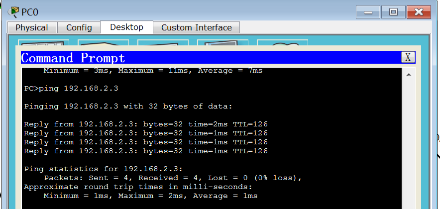

### 实验一：网络搭建及路由协议

**计64	嵇天颖	2016010308**

---

**目录**

[TOC]

---

#### 任务一：IP分配方案

**修改项如下：**

1. 我们为`Router2`端口2应当分配`IPv4 reserved address`，而表中为它分配了公网地址。

   因此我们要为它配置一个`IPv4`保留地址，从A类保留地址中`10.0.0.0-10.255.255.255`中选取，简单起见，为之分配`10.2.3.2`。

2. 与`Router2`端口2连接的`Router3`的端口应当分配同一个子网的，我们为它分配上`10.2.3.3`。

3. `Server0`通过交换机`Switch0`可以联通到`Router1`的端口1上，与`PC0`,`Laptop0`情况一致，因而它的`Gateway`应当是`192.168.1.1`。

   

**修改项汇总如下：**

| Device  | Port  | IP          | Mask | Gateway     |
| ------- | ----- | ----------- | ---- | ----------- |
| Router2 | 端口2 | 10.2.3.2    | /24  | -           |
| Router3 | 端口1 | 10.2.3.3    | /24  | -           |
| Server0 | 端口1 | 192.168.1.3 | /24  | 192.168.1.1 |
|         |       |             |      |             |

---

#### 任务二：网络铺设

实现过程：

1. 选择合适的设备及连线将该网络铺设出来
  
* 因为`Router2`需要3个端口，为了统一，我给三个路由器都加上了`HWIC-2T`模块
  
2. 配置`Router`路由

   * 配置`Router1`路由

     * 配置端口1的`IP`

     ~~~c++
     Router>enable
     Router#conf ter
     Router(config)#hostname r1
     r1(config)#interface FastEthernet 0/0
     r1(config-if)#no shutdown	
     r1(config-if)#ip address 192.168.1.1 255.255.255.0
     ~~~

     * 配置端口2的`IP`

     ~~~c++
     r1(config)#interface Serial0/0/0
     r1(config-if)#no shutdown
     r1(config-if)#ip address 10.1.2.1 255.0.0.0
     ~~~

     * 保存一下配置

     ~~~c++
     r1#copy running-config startup-config 
     ~~~

   * 配置`Router2`和`Router3`与上面方法一致

     我们可以查看配置结果，`Router3`配置结果显示如下，符合我们的配置要求

     ~~~c++
     r3#show ip interface brief
     Interface         IP-Address   OK? Method Status                Protocol
     FastEthernet0/0   192.168.3.1  YES manual up                    up
     FastEthernet0/1   unassigned   YES unset  administratively down down
     Serial0/0/0       10.2.3.3     YES manual up                    up
     Serial0/0/1       unassigned   YES unset  administratively down down
     Vlan1             unassigned   YES unset  administratively down down
     ~~~

     

3. 配置终端`IP`

   * 配置`PC0`，在`Desktop`的`IP Configuration`中进行配置`IP`地址，子网掩码和默认网关

     

   * 其他的`PC`,`Server`和`Laptop`的配置同理

     

4. 最终铺设效果如图，可以看到在仿真效果下已经连通

   

---

#### 任务三：公网网关安全

**配置`Router`密码**

我的清华`ID`是`jity16`，所以配置的密码都是以`jity16`开头

1. 用户模式的口令`password1`:`jity16@console`

   通过`console`口进入用户模式口令设置如下：

   ~~~c++
   r1(config)#line console 0
   r1(config-line)#password jity16@console
   r1(config-line)#login
   r1(config-line)#end
   ~~~

2. 特权模式的口令`password2`:`jity16@privilege`

   通过用户模式进入特权模式的口令设置如下：

   ~~~c++
   r1#en
   r1#conf t
   r1(config)#enable password jity16@privilege
   r1(config)#exit
   ~~~

3. 通过`telnet`方式登录路由器的口令`password3`:`jity16@vty`

   ~~~c++
   r1(config)#line vty 0 4
   r1(config-line)#password jity16@vty
   r1(config-line)#login
   r1(config-line)#end
   ~~~

4. 实际效果

   尝试进行登录，如图，说明密码设置成功

   

**如果路由器配置文件可能泄露，你的设置是否有所变化？**

1. 首先我们查看我们的密码配置，发现在配置文件中密码都以明文存储：

   ~~~c++
   //password 2 - privilege mode
   enable password jity16@privilege
     
   //password 1 - user mode
   line con 0
    password jity16@console
    login
   
   //password 3 - telnet login
   line vty 0 4
    password jity16@vty
    login
   ~~~

   

2. 如果配置文件泄露，等于密码都被泄露了，需要对配置进行变化

   * 修改一：设置特权态密码时用`secret`

     设置如下

     ~~~c++
     r1(config)#enable secret jity16@secret
     ~~~

     `password`和`secret`同时设置时，`secret`优先级比较高，只有`secret`生效，这时候配置文件变成：

     

     也就是说进入特权态的密码已经被加密成功，无法从配置文件直接得到登录密码

   

   * 修改二：这时候，我们继续观察配置文件，发现

     

     `password1`和`password3`还是明文存储，我们设法对此也进行加密处理

     方法入下：

     ~~~c++
     r1(config)#service password-encryption 
     ~~~

     此时配置文件：

     * 连因为优先级没有`secret`高而不生效的`password`也被加密了

     

     * 于此同时，`password1`和`password3`也被加密了

       

**攻击者进行暴力破解时时间需求的变化**

1. 总长六位的纯数字密码：是1e7量级的
   $$
   每位有10种可能数字，一共有6^{10}种可能密码，每种密码等概率出现，则暴力破解时间\\
   E(time) = \frac{1}{6^{10}}\times(1+2+...+6^{10})=\frac{1+6^{10}}{2}=30233088.5
   $$
   
2. 总长六位的混合有数字及小写字母的密码：是1e27量级的
   $$
   每位有36种可能，一共有6^{36}种可能\\
   因为要求是混合，所以排除全部都是数字或者全部都是小写字母的情况，也就是6^{36}-6^{10}-6^{26};\\
   E(time)\approx 5.157\times10^{27}
   $$
   
3. 总长六位的混合有数字、大写字母、小写字母的密码：是1e47量级的
   $$
   每位有62种可能，一共有6^{62}种可能\\
   因为排除不是三种混合的情况对总可能数影响甚微，所以我们不再考虑\\
   E(time)\approx 8.7973\times10^{47}
   $$
   
4. 总长八位的混合有数字、大写字母、小写字母的密码：是1e55量级的
   $$
   每位有62种可能，一共有8^{62}种可能\\
   因为排除不是三种混合的情况对总可能数影响甚微，所以我们不再考虑\\
   E(time)\approx 4.9040\times10^{55}
   $$
   

----

#### 任务四：静态路由能保障网络通信

**配置静态路由**

1. 配置`Router1`的静态路由

   因为它所不能直达的网段是`192.168.2.0`和`192.168.3.0`和`172.16.2.0`

   所以我们为它配置路由，这三个网段对于`Router1`来说，下一跳转发的`IP`都是`Router2`的端口1

   ~~~c++
   r1(config)#ip route 192.168.2.0 255.255.255.0 10.1.2.2
   r1(config)#ip route 192.168.3.0 255.255.255.0 10.1.2.2
   r1(config)#ip route 10.2.3.0 255.255.255.0 10.1.2.2
   ~~~

   配置结果查看如图：
   

2. 配置`Router2`的静态路由

   因为它所不能直达的网段是`192.168.1.0`和`192.168.3.0`，我们为它配置路由

   ~~~c++
   r2(config)#ip route 192.168.1.0 255.255.255.0 10.1.2.1
   r2(config)#ip route 192.168.3.0 255.255.255.0 10.2.3.3
   ~~~

   配置结果查看如图：

   

3. 配置`Router3`的静态路由

   ~~~c++
   r3(config)#ip route 192.168.1.0 255.255.255.0 10.2.3.2
   r3(config)#ip route 192.168.2.0 255.255.255.0 10.2.3.2
   r3(config)#ip route 10.1.2.0 255.255.255.0 10.2.3.2
   ~~~

   配置结果查看如图：

   

**测试网络通信**

1. 测试路由器间通信

   * `Router3 ping Router1`

   

   ​	

   * `Router1 ping Router3`

   

2. 测试不同网段的终端通信

   * `PC0 ping Laptop1`

   

   

   * `PC1 ping Laptop 3`

   

   

   * `Laptop2 ping Server0`

   

**结论**

根据上面的测试，我们可以发现静态路由已经配置好，并且没有冗余的静态路由，不同部门间可以实现网络间通信。

---

#### 任务五：路由协议能高效保障通信

**问题解答**：

`RIP`协议限制网络跳数在16跳以内，公司里终端设备加起来不到16台，也就是最坏情况下网络直径最大为15，所以`RIP`协议能够满足要求

**配置`RIP`协议**

公司目前的局域网用`RIP`协议可以满足要求，最大跳数远小于16跳。

1. 配置`Router1`

   * 首先删除配置好的静态路由：

   ~~~c++
   r1(config)#no ip route 192.168.2.0 255.255.255.0 10.1.2.2
   r1(config)#no ip route 192.168.3.0 255.255.255.0 10.1.2.2
   r1(config)#no ip route 10.2.3.0 255.255.255.0 10.1.2.2
   ~~~

   * 进入 `RIP` 配置模式

   ~~~c++
   r1(config)#router rip
   ~~~

   * 公告直连网段

     由于 RIP 不支持设置变长子网掩码，所以 `10.x.x.x` 开头的地址都会被强制设定为 `10.0.0.0`，所以在配置时直接配置称`10.0.0.0`即可

   ~~~c++
   r1(config)#router rip
   r1(config-router)#network 192.168.1.0
   r1(config-router)#network 10.0.0.0
   ~~~

2. 配置`Router2`和`Router3`的方法与上面雷同

   

**配置结果**

* 我们先查看配置文件（这里展示`Router3`的配置文件，可以看到公告的直连网段）

  

  

* 我们查看`RIP`路由表，可以看到`Router3`路由表已成功学习

  

* 进行网络通信测试`Router3 ping Router1`，网络通信正常

  

  

* 用`tracert`进行路径追踪(从`192.168.3.2`到`192.168.1.3`)

  可以发现经过四跳到达目的地址

  

  

---

#### Bonus任务

##### Bonus Task1

起先我所设置的`secret`密码是`jity16@secret`,查看配置文件：

发现采用的是`secret 5`，查阅发现采用的是`MD5`算法

我在`MAC OS`下用`openssl`进行了加密验证

发现加密得到的结果一致

##### Bonus Task 2

**结论**：`ARP`广播过程会造成丢包，在实验环境下，可能会造成第一次无法`ping`通的现象

**分析**：在实验时，我第一次用`ping`的时候出现了不通的现象，是`PC0 ping PC1`的时候，我就用这个过程为例分析

1. 起初`PC0`只知道目的`IP`，不知道`Router 0 `的`MAC`地址，发送`ARP`广播请求获取`Router 0 `的`MAC`地址
2. `Router 0 `的`F0/0`端口接收到`ARP`广播，查看数据帧发现是自己的`IP`地址，`F0/0`端口作出回应，`PC0`收到回应并进行`ARP`缓存
3. `PC0`发送带有目的`MAC`地址的`ping`包，`Router 0 `的`F0/0`端口接收到并发现目的`MAC`地址是自己，然后开始查看路由表进行匹配。而我们已经配置好了静态路由，所以它知道要发送的方向。
4. 此时需要重新封装`MAC`头部信息，但是不知道目标`MAC`地址，只能丢弃`ping`包，并在端口`Se 0/0/0`发起`ARP`广播
5. `Router2`接收到广播，发现目标`IP`是自己，给出回应也就是自己的`MAC`地址。但它也不知道`PC1`的`MAC`地址，所以只能丢弃`ping`包，并在端口`F0/0`发起`ARP`广播，获取了`PC1`的`MAC`地址
6. 此时`PC1`收到该广播，拆包发现目标`IP`是自己的，对`Router1`的`F0/0`端口给出回应，告诉它自己的`MAC`的地址，此时`Router1`的`F0/0`端口缓存该回应的信息
7. 此时`PC0`的`ping`包数据再次过来，终于不会被丢弃了，成功了

所以，这个广播过程中会丢弃`ping`包，所以很有可能在第一次`ping`的时候失败，后来又能成功是因为缓存的`ARP`表里面已经记录了目的`MAC`地址，可以不丢包地发送了。

